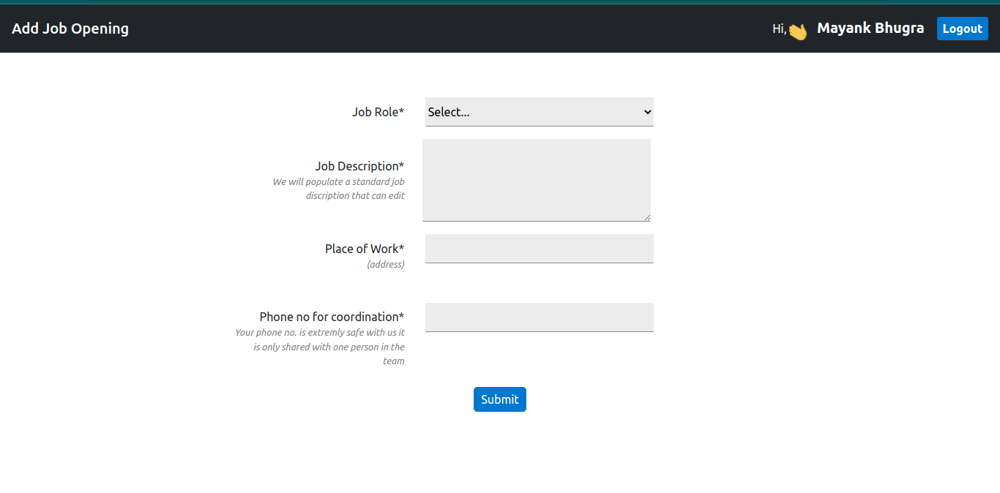

# Able Job Portal
This is a simple website where users can Log In/ Register and post a job opening.
<div style="display:flex;flex-direction:column; justify-content:space-around">
    
    
</div>
<br></br>
<div style="display:flex; justify-content:space-around">
    
    
</div>
<br></br>

## Features
<hr>

* Login
* Register
* Add job opening
<br></br>

## Requirements
<hr>

* Python >= 3.7
* pip3
* Django 4.0.4
<br></br>

## Django installation steps:
<hr>

* Install Python using 
* Install python3.7 or Higher
* Install Django version 4.0.4
<br></br>

## For Run server
<hr>

Run this command
* For ubuntu
``` python3 manage.py runserver ```

* For Windows
``` python manage.py runserver ```
